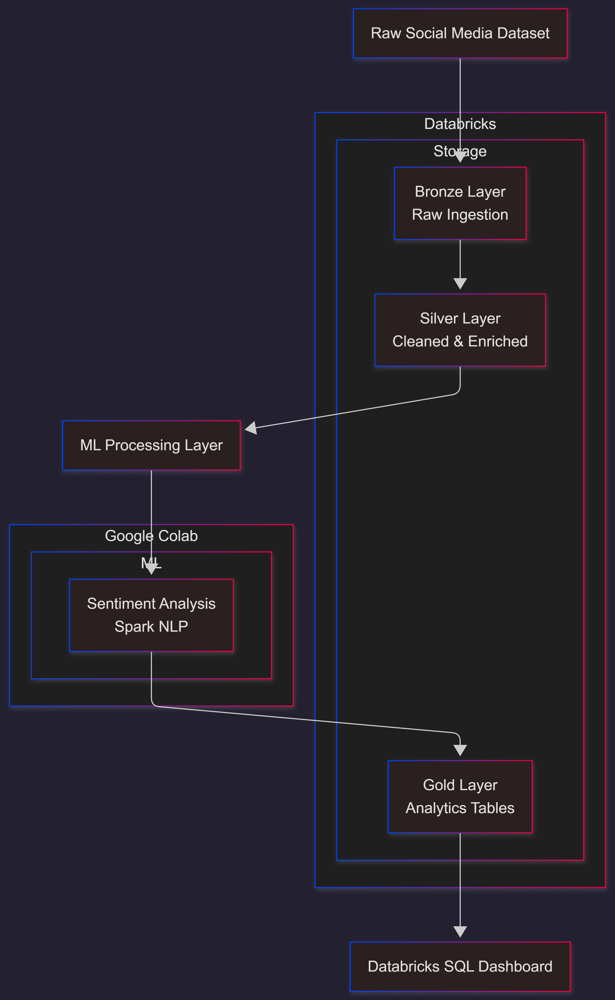

# 📊 Social Media Sentiment Analysis Platform  
**End-to-End Data Engineering & ML Pipeline**

---

## 🔍 Overview

This project implements an **end-to-end sentiment analytics platform** for social media data using **Apache Spark, NLP, and ML models**, following an **industry-grade medallion architecture**.

The pipeline ingests raw data, performs scalable transformations, applies **sentiment analysis**, and exposes **business-ready insights** through interactive dashboards.

---

## 🏗️ Architecture



##**High-level flow:**

```
Raw -> Bronze → Silver → ML → Gold → Dashboard
```

---

## 🧱 Medallion Architecture

### 🥉 Bronze Layer – Raw Ingestion
- Stores raw social media data
- Enforced schema, no transformations
- Mirrors source structure

**Purpose:** Traceability & replayability

---

### 🥈 Silver Layer – Cleaned & Enriched
- Deduplication
- Language filtering (English)
- Timestamp normalization
- Text cleaning
- Feature engineering:
  - Hashtag / mention flags

**Purpose:** Analytics & ML-ready dataset

---

### 🤖 ML Processing Layer

ML inference is **decoupled from Spark ETL**, following industry best practices.

#### Sentiment Analysis
- Spark NLP


**Outputs:**
- `sentiment_label`

---

### 🥇 Gold Layer – Analytics

Business-ready aggregated tables:
- Hashtag trends
- Daily sentiment trends
- Sentiment Distribution percentage
- Daily Trending Topics
- Top Users

Optimized for dashboard performance.

---

## 📊 Dashboard (Databricks SQL)

**Key Insights:**
- Daily sentiment trend (positive vs negative)
- Daily Trending Topics
- Overall Hashtag trends

**Design Principles:**
- KPIs separated from trends
- Time-series optimized aggregations
- Business-readable visuals

---

## ⚙️ Tech Stack

|     Category    |       Technology         |
|-----------------|--------------------------|
|    Processing   |       Apache Spark       |
|     Storage     |   Parquet / Delta Lake   |
|    Sentiment    |        Spark NLP         |
|    Analytics    |      Databricks SQL      |
|  Visualization  |   Databricks Dashboards  |

---

## 🧠 Key Design Decisions

- Medallion architecture for data quality
- Spark for ETL, sparknlp for ML
- Materialized Gold tables for analytics

---

## 📁 Repository Structure

```
.
├── bronze/
├   ├── bronze_notebook.ipynb
├── silver/
├   ├── silver_notebook.ipynb
├── ml/
│   ├── ml_flow_notebook.ipynb
├── gold/
├   ├── gold_notebook.ipynb
├   ├── gold_sql_views.ipynb
├── Screenshots/
│   ├── bronze/
│   ├── silver/
│   ├── gold/
│   ├── dashboard/
├── architecture/
│   └── architecture_diagram.png
└── README.md
```

---

## 🏁 Conclusion

This project demonstrates:
- Strong **data engineering fundamentals**
- Practical **ML integration at scale**
- Clean **analytics & visualization design**
- Production-style thinking

